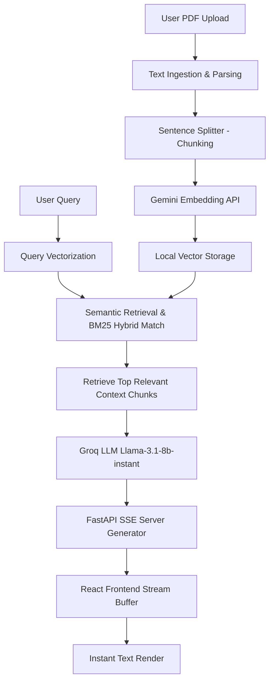

# PDF Q&A Agent: RAG Architecture & In-Depth Guide

Welcome to the technical guide for your **PDF Q&A Agent**. This document explains how the entire system operates—from the moment you upload a PDF to when the final word streams onto the screen—and addresses specific performance and caching questions.

---

## 1. The Core Architecture (RAG)
This application utilizes **Retrieval-Augmented Generation (RAG)**. Instead of sending your entire PDF files to the LLM (which would be slow and expensive), the system retrieves only the relevant pages/paragraphs and feeds them to the LLM as context.

Here is the step-by-step process of how an input is transformed into a response:



---

## 2. Detailed Pipeline: Input to Output

### Phase A: PDF Ingestion & Embedding Storage
1. **Parsing**: When you upload a PDF (or on startup), `SimpleDirectoryReader` extracts the text page-by-page.
2. **Chunking**: The text is split into small pieces called "nodes" using `SentenceSplitter`. 
   * **Size**: 512 tokens per chunk.
   * **Overlap**: 80 tokens (this ensures text context isn't cut off at chunk boundaries).
3. **Embedding (Vectorization)**: Each text chunk is sent to the **Google Gemini Embedding Model** (`models/gemini-embedding-001`).
   * The model translates human words into a **768-dimensional mathematical vector** (a list of 768 decimal numbers).
   * These numbers represent the semantic "meaning" of that text chunk.
4. **Storage**: The vectors and their corresponding text contents are saved locally inside the `./backend/storage/` directory in JSON files:
   * **`default__vector_store.json`**: Stores the numerical embedding vectors.
   * **`docstore.json`**: Stores the actual text contents mapped to their IDs.
   * **`index_store.json`**: Stores metadata about the index structures.

### Phase B: Querying & Retrieval
1. **Query Vectorization**: When you ask *"tell me education of mahi"*, the query is converted into a 768-dimensional vector using the same Gemini Embedding API.
2. **Vector Search**: The system calculates the similarity score (cosine distance) between your query vector and all the stored document chunk vectors.
3. **Keyword Search (BM25)**: In parallel, a keyword search matches terms (like "mahi", "education") to exact occurrences in the documents.
4. **Hybrid Retrieval**: The system combines the semantic vector results and keyword search results to fetch the **Top 3** most relevant chunks.

### Phase C: Generation & SSE Streaming
1. **LLM Prompting**: The retrieved context chunks are inserted into a prompt:
   ```text
   Context information is below:
   ---------------------
   [Relevant Chunks from Mahi Prajapati resume.pdf]
   ---------------------
   Given the context information and not prior knowledge, answer the query.
   Query: tell me education of mahi
   ```
2. **LLM Execution**: The prompt is sent to the ultra-fast **Groq `llama-3.1-8b-instant`** model.
3. **Server SSE Streaming**: As Groq starts generating the answer token-by-token, FastAPI yields each token instantly over a Server-Sent Events (SSE) connection using chunked transfer encoding.
4. **Frontend Line Buffering**: The React frontend (`App.jsx`) receives the raw network bytes, buffers them to prevent split-word errors, parses the JSON tokens, and displays them onto the screen dynamically.

---

## 3. Answer: Why Did it Always Re-Embed Files on Startup?

### The Bug That Was Fixed
Previously, the backend was executing the auto-indexing pipeline and calling the embedding APIs **every single time the server restarted**. 

This was caused by a tiny filename mismatch in `rag_agent.py`:
* **The Code Checked For**: `vector_store.json`
* **LlamaIndex Actually Generates**: `default__vector_store.json`

Because the file `vector_store.json` was never found, the agent assumed there was no cached index on disk and proceeded to rebuild and re-embed all documents from scratch. 

### The Solution
I have updated `rag_agent.py` to check for `default__vector_store.json` instead. Now, when you start the server, it will output:
```text
[RAG Agent] Loading index from storage...
```
It loads the index **instantly** from your local disk without calling any embedding API or re-uploading your files!

---

## 4. Latency: Long vs. Short PDFs

| Attribute | Short PDF (1–2 pages) | Long PDF (30+ pages) | Why the Difference? |
| :--- | :--- | :--- | :--- |
| **Ingestion Time** | Instant (< 1 second) | Moderate (3–5 seconds) | Long PDFs have many more pages, requiring more API calls to generate embeddings. |
| **Search Time** | Extremely Fast (~0.05s) | Extremely Fast (~0.08s) | Vector search is mathematically highly optimized. Comparing vectors takes milliseconds even for thousands of chunks. |
| **Context Window Size** | Very Small | Moderately Large | Long PDFs may yield chunks with more complex context, requiring the LLM to process more tokens before responding. |
| **LLM Output Latency** | Low | Low (with Groq) | Groq generates 200+ tokens per second, making generation times almost identical once streaming begins. |

---

## 5. How It Searches Within a Particular PDF

When you ask a question like *"tell me education of mahi"* or ask about a specific document, how does the system isolate that file?

1. **Explicit Metadata Tags**: During the ingestion phase, every text chunk is tagged with metadata:
   ```json
   {
     "file_name": "Mahi Prajapati resume.pdf",
     "page_label": "2"
   }
   ```
2. **Retrieval Filtering**: During retrieval, LlamaIndex matches terms from the query against these metadata fields. If the query mentions *"mahi"*, the search vectors naturally align closest to the chunks originating from `Mahi Prajapati resume.pdf`.
3. **Strict Prompt Constraint**: The prompt instructions state:
   > *"If the query asks about a specific person or document, focus ONLY on the retrieved chunks that belong to that subject/file."*
   This prevents the LLM from mixing context from `Vidhi_shah.pdf` into Mahi's response.
