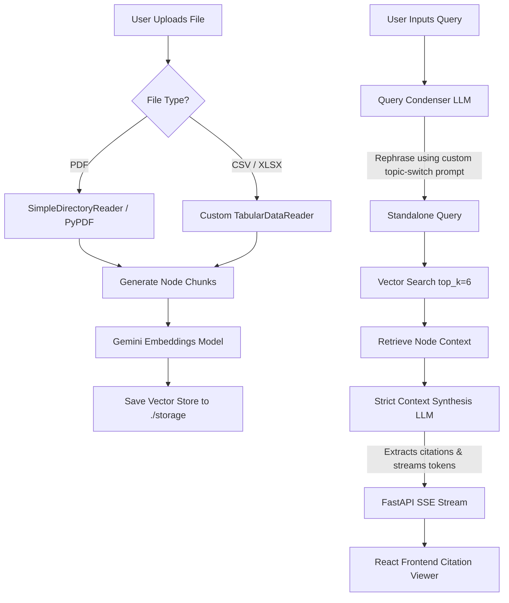

# Implementation Flow & Architecture Guide: Multiple PDF/CSV Q&A Agent

This document provides a comprehensive, end-to-end overview of the architecture, technologies, libraries, and custom logic implemented to build and optimize the **Multiple PDF & CSV Q&A Agent**.

---

## 🛠️ Technology Stack & Libraries

The system is split into a **Vite/React frontend** and a **FastAPI/LlamaIndex backend**:

### 1. Frontend
* **Core**: React.js (functional components, hooks) & Vite (fast bundler).
* **Styling**: TailwindCSS & Vanilla CSS (animations, responsive layouts).
* **Communication**: Native `EventSource` API for handling server-sent events (SSE) for real-time text streaming.

### 2. Backend
* **API Framework**: `FastAPI` (high-performance asynchronous framework) & `Uvicorn` (ASGI web server).
* **RAG Framework**: `LlamaIndex` (orchestration of document ingestion, storage, retrieval, and synthesis).
* **LLM Engine**: `Groq` API (`llama-3.1-8b-instant` for ultra-low latency inference).
* **Embeddings Model**: `google.generativeai` (`models/embedding-001` or Gemini Embeddings for vector representations).
* **File Processing**: `PyPDF` (for reading PDF pages) & `pandas` (for tabular parsing).
* **Environment Management**: `python-dotenv` (for loading API keys from `.env`).

---

## 🔄 End-to-End System Flow

---

## 📂 Component Specifications & Custom Implementations

### 1. Ingestion & Semantic Parsing
When a user uploads a document, the system parses it and converts it into mathematical vectors (embeddings) for similarity searches:
* **PDF Ingestion**: Handled page-by-page using PyPDF. Each chunk retains metadata containing the `file_name` and `page_label`.
* **Tabular Ingestion (`TabularDataReader`)**: Standard text splitters read CSVs row-by-row, losing column relationship headers. We implemented a custom batching parser that:
  1. Reads sheets/CSVs using `pandas`.
  2. Batches rows into groups of 10.
  3. Formats each batch with column headers prefixed to every row to preserve vertical context.
  4. Yields coherent semantic chunks to ensure data matches accurately.

### 2. Index Management & Safe Deletion
When a user deletes a file from the UI, the index must remain fully synced to prevent database corruption or wrong search hits:
* **The Bug**: LlamaIndex's native `index.delete_ref_doc()` is brittle and errors when references are out of sync. Trying to rewrite properties throws `AttributeError` (read-only properties).
* **The Solution**: We built a custom safe deletion routine in `rag_agent.py`:
  1. Scans the index `docstore` to match document nodes with the targeting `file_name`.
  2. Aggregates the unique parent/reference IDs (`ref_doc_id`).
  3. Deletes them explicitly from the Vector Store.
  4. Safeguards against missing keys in the `index_struct` and `docstore`, clearing out all nested sub-nodes and saving back to disk.

### 3. Multi-Turn Topic Switching
In standard conversational search engines, the chat history pollutes new queries (e.g. asking about Mahi's resume after discussing jQuery Ajax retrieves Ajax documents instead of Mahi's resume):
* **Topic-Switch Detection**: We overrode the default `condense_prompt` in `CondensePlusContextChatEngine`.
* **The Logic**: It instructs the rephrasing LLM to analyze the follow-up question. If it detects a topic shift, it ignores previous chat history keywords (e.g. Ajax) and keeps the standalone query pure, directing the search to the correct document immediately.

### 4. Strict "Files-Only" Validation (Zero Hallucination)
To restrict the LLM to **only** answer from your files, we overrode the default templates (`context_prompt` and `context_refine_prompt`):
* **Custom Context Prompt**: Removes LlamaIndex's default "friendly/talkative chatbot" instruction. It strictly tells the LLM:
  > *"Your ONLY source of truth is the Context Information. Under no circumstances use external knowledge or internal facts. If the information is not present, reply exactly: 'I cannot find that information in the uploaded documents.'"*
* **Citation Rule**: 
  - If information is found, the system appends the source in a specific format: `[Source: <file_name>, Page: <page>]`.
  - If information is not found, the model returns **only** the `"NOT FOUND"` message and cleanly omits the citation line.
* **Top-K Search Tuning**: Increased retrieval similarity search `similarity_top_k` to `6` to ensure the system scans a wider set of files before giving up.

### 5. Asynchronous Streaming & Citation Highlights
* **SSE Stream**: Tokens are yielded as they generate using Python generator coroutines (`async for token in response.async_response_gen()`).
* **Citation Exchange**: Structured metadata is appended at the very end of the socket stream: `\n__CITATIONS_METADATA__:<JSON_DATA>`. This separates the text response from the source documents.
* **Page String Normalization**: In `CitationViewer.jsx`, page variables are compared using string cast comparisons (`.toString().trim()`), resolving highlights failing due to type differences (e.g., comparing page float `1.0` to page string `1`).
